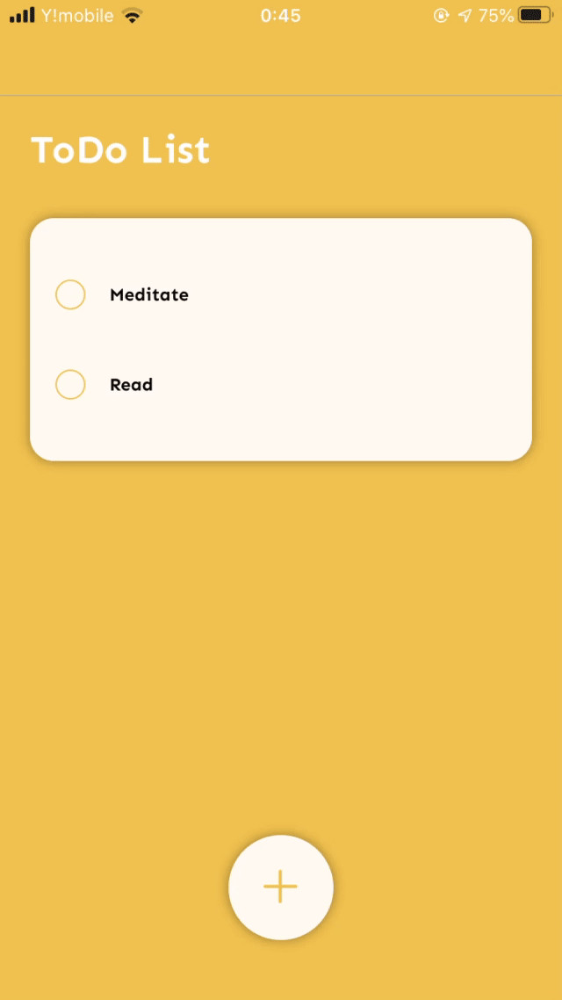

# タスクアプリ



<p align='center'>関連ブログ:  https://gitpress.io/@fukke0906/2020-03-11 </p>

## Description
簡単なタスクアプリです.  

## Requirement
- expo-cli
- typescript

## Usage
1. clone
```bash
$ git clone https://github.com/FukeKazki/ReactNative-ToDo-App-TS.git
```
2. run
```bash
$ expo install
$ expo start
```